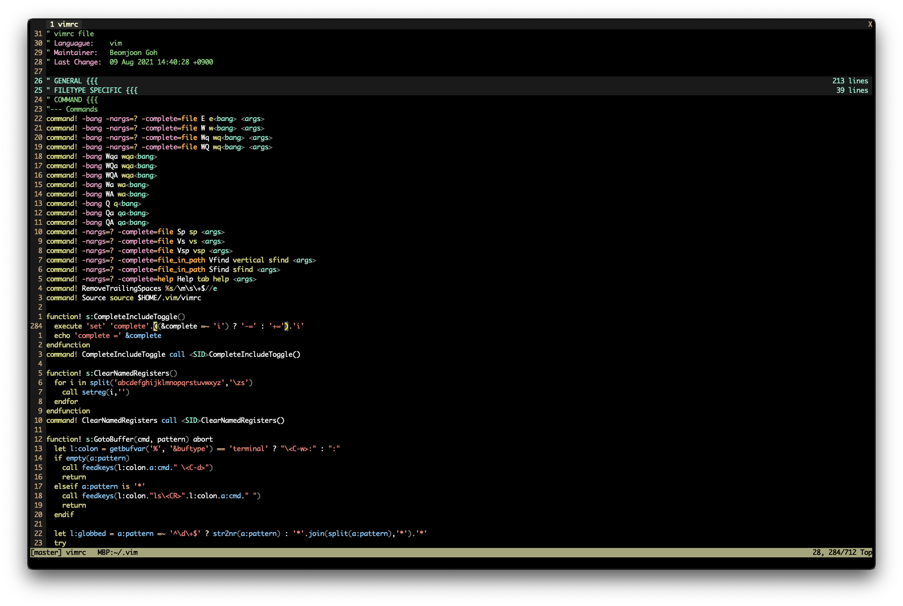
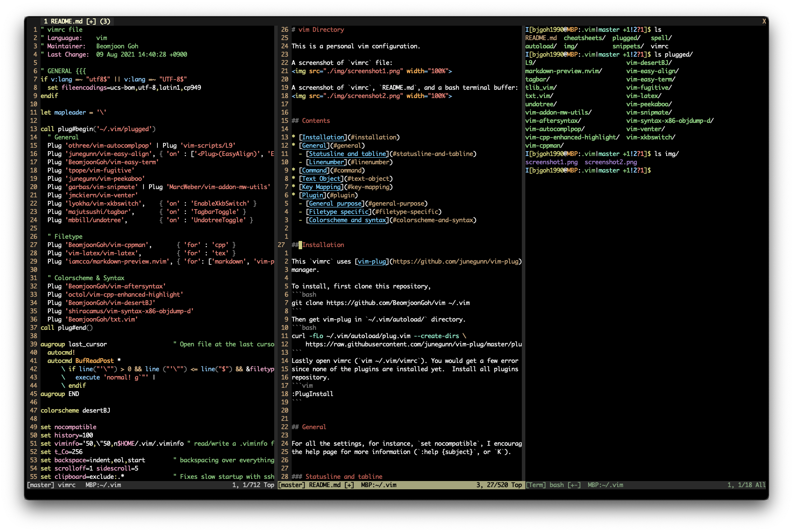

# vim Directory

This is a personal vim configuration.

A screenshot of `vimrc` file:


A screenshot of `vimrc`, `README.md`, and a bash terminal buffer:



## Contents

* [Installation](#installation)
* [General](#general)
  - [Statusline and tabline](#statusline-and-tabline)
  - [Linenumber](#linenumber)
* [Command](#command)
* [Text Object](#text-object)
* [Key Mapping](#key-mapping)
* [Plugin](#plugin)
  - [General purpose](#general-purpose)
  - [Filetype specific](#filetype-specific)
  - [Colorscheme and syntax](#colorscheme-and-syntax)


## Installation

This `vimrc` uses [vim-plug](https://github.com/junegunn/vim-plug) plugin
manager.

To install, first clone this repository,
```bash
git clone https://github.com/BeomjoonGoh/vim ~/.vim
```
Then get vim-plug in `~/.vim/autoload/` directory.
```bash
curl -fLo ~/.vim/autoload/plug.vim --create-dirs \
    https://raw.githubusercontent.com/junegunn/vim-plug/master/plug.vim
```
Lastly open vimrc (`vim ~/.vim/vimrc`). You would get a few error messages
since none of the plugins are installed yet.  Install all plugins used by this
repository.
```vim
:PlugInstall
```


## General

For all the settings, for instance, `set nocompatible`, I encourage you to see
the help page for more information (`:help {subject}`, or `K`).


### Statusline and tabline

Statusline:

    ([Help],[{branch}]){file} ([+],[-])([RO])  cwd:{path}        {cursor_pos}
    [master] README.md [+]  cwd:~/.vim                       2-9, 275/378 75%

Tabline: `{tab}`  = `{tab_num} {file} ([+],[*]) (({tot_win}))`

    {tab}  {tab}  {tab}                                                     X
    1 README.md [+]  2 vimrc (2)                                            X

* `{branch}`: Git branch name of the current buffer.
* `{file}`: Currently opened buffer name. Shortened if too long.
* `{path}`: Vim's current working directory. Shortened if too long.
* `[+(-)]`: If `file` is modified (not modifiable).
* `[*]`: If there exist modified buffers on out of focus window.
* `[RO]`: If `file` is read only.
* `{cursor_pos}`: `{column}-{virtucal_column}, {line}/{total_lines} {percent}`
* `X` : Close button for mouse

See `:help statusline, :help tabline`


### Linenumber

If 'relativenumber' is on, for the file types `help`, `man`, `diff`, `tagbar`,
and `undotree`, turn off 'relativenumber' when focus is lost where relative
number doesn't make a lot of sense.  Motivation is that vim help files
typically set nonumber but does not care about relativenumber.  Note also that
setting relativenumber on may slow down scrolling.


## Text Object

A few custom text objects are defined (see`:help text-objects`):

| Key      | Mode | Description |
|:--------:|:----:|:------------|
|`il`, `al`| x o  | Current line (`a` with surrounding whitespaces)
|`ii`, `ai`| x o  | Indent
|`in`, `an`| x o  | Number (`a` with surrounding whitespaces)
|`i/`, `i?`| x o  | Search pattern


## Command

For builtin commands `:e`, `:q`, `:qa`, `:w`, `:wa`, `:wq`, `:wqa`, `:sp`, and
`:vsp`, possible uppercase typos are defined.

* `:Vfind`(`Sfind`) works like `:find` but in vertical(horizontal) split.
* `:Help` opens help page in new tab not in split
* `:RemoveTrailingSpaces` does what it sounds like.
* `:Source` sources `vimrc`.
* `:CompleteIncludeToggle` toggles `i` flag for `'complete'` option.
* `:ClearNamedRegisters` does what it sounds like.
* `:B` calls `GoToBuffer()` that moves cursor to or split opens a buffer in the
  buffer list with an automatic globbing of given arguments.
* `:SmallScreen` disables number, statusline, and tabline.
* `:OpenFinder`<sup>[[1]](#MacOS)</sup> opens a `Finder` window of the current
  buffer.
* `:Cheat` vertically split opens a cheatsheet if available.
* `:CheatEdit` vertically split opens a cheatsheet if available for editing.

Additionally, it sources the builtin `man.vim` script, and related options
```vim
runtime! ftplugin/man.vim
```
so that a man page is opened inside vim (on a new buffer) by `:Man` command.
For example to open bash's man page,
```vim
:Man bash
```


## Key Mapping

The backslash key (`\`) is used as The "mapleader" variable. The characters n,
i, x, o, and t stand for normal, insert, visual only, operator pending, and
terminal mode respectively.  See `:help map.txt` for help and `:map` to see
defined maps.

<details close>
  <summary>General</summary>
  
  | Key      | Mode | Description |
  |:--------:|:----:|:------------|
  |`gf`, `gF`| n    | Open a file under cursor in vertical split (current window).
  |`<S-Tab>` | i    | Tab backwards.
  |`~`       | n x  | The `~` key works for non-alphabets as well.
  |`<CR>`    | n    | Enter works in normal mode.
  |`<C-y>`   | x    | Yank to clipboard (register `"\*`).
  |`<C-p>`   | n    | Paste from clipboard (register `"\*`).
  |`\r`      | n    | Stop highlighting search result.
  |`\R`      | n    | Clear search result with some random text.
  |`*`, `#`  | x    | Search in visual mode.
  |`\iw`     | n    | In diff mode, toggle ignore white spaces.
  |`gb`      | n    | Call `:B` command.
  |`go`<sup>[[1]](#MacOS)</sup>| n x  | Open URL/file under cursor.
  |`::`      | t    | Switch mode from terminal to cmdline
  |`K`       | n    | If filetype is `vim`, do `:tab help`, if `sh` or `man`, do `:Man`.
  |`<F2>`    | n    | Manual page for `LAPACK` library functions.
  |`<F4>`    | n i  | Toggle `colorcolumn=120`.
  |`<F6>`    | n i  | Toggle (clipboard) copy & paste safe mode.
  |`<F7>`    | n i  | Toggle spell checking.
  |`<F9>`    | n i  | Show(n) or insert(i) the current date and time stamp.
  |`<F10>`   | n    | Toggle mouse on and off.
  |`\lt`     | n x  | Feed tex to `latexthis` program.
</details>

<details close>
  <summary>Moving around</summary>
  
  | Key    | Mode | Description |
  |:------:|:----:|:------------|
  |`Arrows`| n t  | Jump around split windows.
  |`j`     | n    | Go up to the next row for wrapped lines.
  |`k`     | n    | Go down to the next row for wrapped lines.
</details>

<details close>
  <summary>QuickFix</summary>
  
  | Key | Mode | Description |
  |:---:|:----:|:------------|
  |`\ll`| n    | Invoke `:make` command and open QuickFix window.
  |`\w` | n    | Open QuickFix window.
  |`\c` | n    | Close QuickFix window.
  |`\.` | n    | Jump to the next error/warning.
  |`\,` | n    | Jump to the previous error/warning.
  |`\g` | n    | From the QuickFix window, go to the code where error occured.
</details>

<details close>
  <summary>Fold</summary>
  
  | Key     | Mode | Description |
  |:-------:|:----:|:------------|
  |`<Space>`| n x  | Open/close folds.
  |`zR`     | n    | Mapped to `zr'
  |`zr`     | n    | Mapped to `zR'
  |`zM`     | n    | Mapped to `zm'
  |`zm`     | n    | Mapped to `zM'
  |`z[N]`   | n    | Set fold level to `[N]` = 0 ~ 9.
</details>

<details close>
  <summary>Tab page</summary>
  
  | Key       | Mode    | Description |
  |:---------:|:--------|:------------|
  |`<Tab>:`   | n       | Type `:tab` in command-line.
  |`<Tab>e`   | n       | Type `:tabedit` in command-line.
  |`<Tab>n`   | n       | Open the current buffer in a new tab page.
  |`<Tab>gf`  | n       | Open a file under cursor in a new tab page.
  |`<C-Tab>`  | n i x t | Go to the next tab page (`iTerm` sends `<F11>`).
  |`<C-S-Tab>`| n i x t | Go to the previous tab page (`iTerm` sends `<F12>`).
  |`<Tab>[N]` | n       | Go to `[N]`th tab page, `[N]` = 1 ~ 6.
</details>

## Plugin

### General purpose

#### [vim-autocomplpop](https://github.com/othree/vim-autocomplpop)

> Auto trigger complete popup menu.

It depends on `L9`.

When the complete popup menu is open, hit `<CR>` to insert the first suggestion
or use `<C-n>` (down arrow) to select next or `<C-p>` (up arrow) to select
previous suggestion.  The variable `g:acp_completeOption` follows the vim's
`'complete'` option.

<details close>
  <summary>Settings</summary>

  ```vim
  let g:acp_enableAtStartup        = 1
  let g:acp_completeOption         = '&complete'
  let g:acp_completeoptPreview     = 1
  let g:acp_behaviorSnipmateLength = -1
  let g:acp_behaviorKeywordLength  = 3
  let g:acp_behaviorKeywordCommand = "\<C-p>"
  ```
  | Key  | Mode | Description |
  |:----:|:----:|:------------|
  |`<F5>`| n i  | Toggle `vim-autocomplpop` plugin.
  |`i`   | n i  | Unmapped.
  |`a`   | n i  | Unmapped.
  |`R`   | n i  | Unmapped.
</details>


#### [vim-easy-align](https://github.com/junegunn/vim-easy-align)

> A Vim alignment plugin

<details close>
  <summary>Settings</summary>

  | Key | Mode | Description |
  |:---:|:----:|:------------|
  |`ga` | n x  | Start interactive `EasyAlign`.
</details>


#### [vim-easy-term](https://github.com/BeomjoonGoh/vim-easy-term)

> Easy Term - vim plugin that makes using vim's :terminal feature easier to
> use.

Commands `:Bterm`, `:Vterm`, and `:Tterm` are defined with `botright`,
`vertical botright`, and `tab` modes respectively. See [Key maps](#key-maps)
for `<Plug>` mappings.

<details close>
  <summary>Settings</summary>

  ```vim
  let g:easy_term_rows = '15,18%'
  let g:easy_term_cols = '100,33%'
  ```
  | Key | Mode | Description |
  |:----:|:----:|:------------|
  |`\cd` | n t  | cd related mappings.
  |`\t`  | n x  | send text mapping.
  |`\p`  | n    | put last output mapping.
  |`\y`  | t    | yank last output mapping.
  |`\s`  | s    | set primary terminal mapping.
  |`\ll` | t    | Call `tovim make` from terminal.
</details>


#### [vim-fugitive](https://github.com/tpope/vim-fugitive)

> fugitive.vim: A Git wrapper so awesome, it should be illegal

Commands `:Vg[it]` is defined for `:vertical belowright G[it]`.  A function
`FugitiveHead()` is used to get the branch name for the `'statusline'`.


#### [vim-snipmate](https://github.com/garbas/vim-snipmate)

> `SnipMate` aims to provide support for textual snippets, similar to
> `TextMate` or other Vim plugins like `UltiSnips`.

It depends on `vim-addon-mw-utils`, `tlib_vim`.

Snippets are stored in `snippets` directory and triggered with `<Tab>` key.
`g:snipMate.no_default_aliases` is set so that aliases such as `C++` -> `C` are
disabled.

Note the following default mappings:
* `<Tab>` inserts the snippets in the insert mode.
* `<C-R><Tab>` shows the snippets in the insert mode.

<details close>
  <summary>Settings</summary>

  ```vim
  let g:snips_author = "Beomjoon Goh"
  let g:snipMate = get(g:, 'snipMate', {})
  let g:snipMate.no_default_aliases = 1
  let g:snipMate.snippet_version    = 1
  let g:snipMate.description_in_completion = 1
  ```
</details>


#### [vim-peekaboo](https://github.com/junegunn/vim-peekaboo)

> Peekaboo extends `"` and `@` in normal mode and `<CTRL-R>` in insert mode so
> you can see the contents of the registers.

<details close>
  <summary>Settings</summary>

  ```vim
  let g:peekaboo_window = 'vertical botright 20new'
  ```
</details>


#### [vim-venter](https://github.com/jmckiern/vim-venter)

> Vim plugin that horizontally centers the current window(s)

Custom toggle function is defined which does `tab split` first.

<details close>
  <summary>Settings</summary>

  | Key  | Mode | Description |
  |:-----:|:----:|:------------|
  |`\f`  | n    | Toggle `vim-venter` in a new tab.
</details>

#### [vim-xkbswitch](https://github.com/lyokha/vim-xkbswitch)

> vim plugin for automatic keyboard layout switching in insert mode

Loaded on `EnableXkbSwitch` which is triggered by
`:XkbSwitchToggle`<sup>[[1]](#MacOS)</sup> command.  It uses the dynamic
library of [input source switcher][issw], a command line tool for switching
the keyboard layout by Vladimir Timofeev.

[issw]: https://github.com/vovkasm/input-source-switcher


#### [tagbar](https://github.com/majutsushi/tagbar)

> Vim plugin that displays tags in a window, ordered by scope

Loaded when `:TagbarToggle` is invoked which is mapped to `<F3>`. Highlight
link `TagbarHighlight` to `Visual`

<details close>
  <summary>Settings</summary>

  ```vim
  let g:tagbar_width            = 30
  let g:tagbar_compact          = 1
  let g:tagbar_indent           = 1
  let g:tagbar_show_balloon     = 0
  let g:tagbar_map_showproto    = 'f'
  let g:tagbar_map_togglefold   = ['<Space>', 'za']
  let g:tagbar_map_openallfolds = ['_', '<kMultiply>', 'zR']
  let g:tagbar_type_markdown    = {
      \ 'ctagstype' : 'markdown',
      \ 'kinds' : [ 'h:Headings', 'l:Links', 'i:Images' ],
      \ 'sort' : 0,
      \}
  let g:tagbar_type_help = {
      \ 'ctagstype' : 'help',
      \ 'kinds' : [ 't:Tags' ],
      \ 'sort' : 0,
      \}
  ```
  | Key  | Mode | Description |
  |:----:|:----:|:------------|
  |`<F3>`| n t  | Toggle `tagbar`.
</details>


#### [undotree](https://github.com/mbbill/undotree)

> The undo history visualizer for VIM

See `:help undo.txt` for more info on builtin undo tree in vim. A custom diff
command, which is more git-diff like, is used.

<details close>
  <summary>Settings</summary>

  ```vim
  let g:undotree_WindowLayout             = 2
  let g:undotree_SplitWidth               = 24
  let g:undotree_DiffpanelHeight          = 10
  let g:undotree_SetFocusWhenToggle       = 1
  let g:undotree_ShortIndicators          = 1
  let g:undotree_HighlightChangedText     = 0
  let g:undotree_HighlightChangedWithSign = 0
  let g:undotree_HelpLine                 = 0
  let g:undotree_DiffCommand = 'custom_diff(){ diff -U1 "$@" | tail -n+3;}; custom_diff'
  ```
  | Key  | Mode | Description |
  |:----:|:----:|:------------|
  |`\u`  | n    | Toggle `undotree`.
</details>


### Filetype specific

#### [vim-cppman](https://github.com/BeomjoonGoh/vim-cppman)

> A plugin for using [*cppman*](https://github.com/aitjcize/cppman) from within
> Vim. *cppman* is used to lookup "C++ 98/11/14 manual pages for Linux/MacOS"
> through either [cplusplus.com](https://cplusplus.com) or
> [cppreference.com](https://cppreference.com).

Loaded when file type is `cpp`.


#### [vim-latex](https://github.com/vim-latex/vim-latex)

> This vim plugin provides a rich tool of features for editing latex files.

Loaded when file type is `tex`.

Note the following default mappings:
* `\lv` view pdf.
* `\ll` compile latex.

<details close>
  <summary>Settings</summary>

  ```vim
  let g:Tex_PromptedCommands    = ''
  let g:Tex_DefaultTargetFormat = 'pdf'
  let g:Tex_ViewRule_pdf        = 'open -a Preview'
  let g:Tex_FoldedEnvironments  = ''
  let g:tex_indent_brace        = 0
  ```
</details>


#### [markdown-preview.nvim](https://github.com/iamcco/markdown-preview.nvim)

> markdown preview plugin for (neo)vim

Loaded when file type is `markdown`. Use `:MarkdownPreview`,
`:MarkdownPreviewStop` commands

<details close>
  <summary>Settings</summary>

  ```vim
  let g:mkdp_auto_close   = 0
  let g:mkdp_refresh_slow = 1
  ```
</details>


### Colorscheme and syntax

#### [vim-aftersyntax](https://github.com/BeomjoonGoh/vim-aftersyntax)

> `after/syntax` directory.

It depends on `vim-cpp-enhanced-highlight` plugin.  Modified syntaxes are: `C`,
`Cpp`, `Python`, `QuickFix`, and `TeX`.


#### [vim-cpp-enhanced-highlight](https://github.com/octol/vim-cpp-enhanced-highlight)

> Additional Vim syntax highlighting for C++ (including C++11/14/17).

`vim-aftersyntax` uses this plugin.

<details close>
  <summary>Settings</summary>

  ```vim
  let g:cpp_class_scope_highlight     = 1
  let g:cpp_class_decl_highlight      = 1
  let g:cpp_member_variable_highlight = 1
  let g:cpp_no_function_highlight     = 1
  ```
</details>


#### [vim-desertBJ](https://github.com/BeomjoonGoh/vim-desertBJ)

> color scheme based on the default desert.vim, motivated by `desertEx` by Mingbai.


#### [vim-syntax-x86-objdump-d](https://github.com/shiracamus/vim-syntax-x86-objdump-d)

> vim syntax for x86/x64 disassemble file created by objdump -d or -D


#### [vim-txt](https://github.com/BeomjoonGoh/vim-txt)

> This is modified version of 'Vim universal .txt syntax file' by Tomasz
> Kalkosiński.

Syntax for `.txt`, `.out`, etc. defined in `ftdetect/txt.vim`.


### Footnotes

<b name="MacOS">[1]</b>: Defined for MacOS only.
